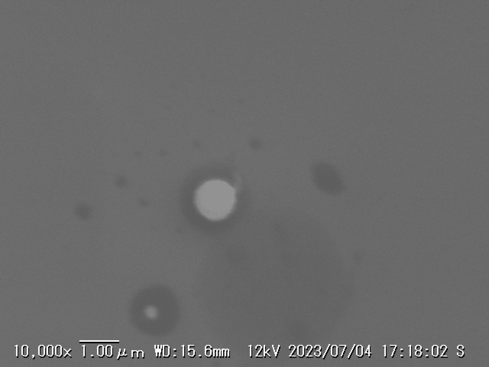
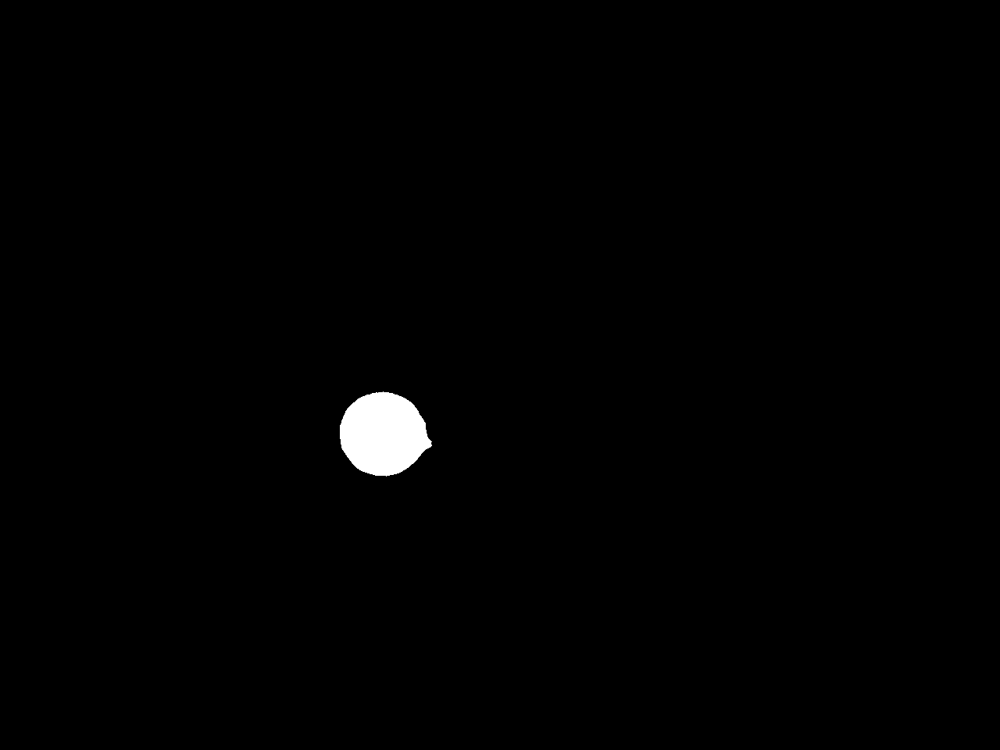
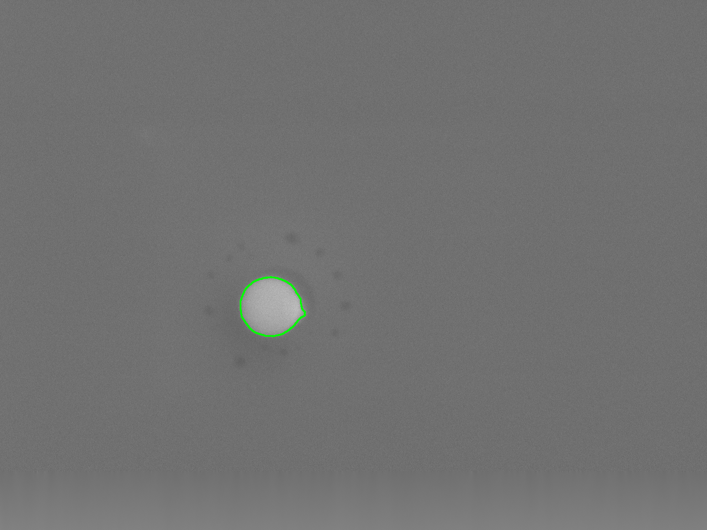

# 🧪 Nanoparticle Segmentation and Defect Detection from SEM Images

---

## 🧠 Overview
This project aims to analyze **nanoparticle morphology** and **detect surface impurities or defects**  
in **SEM (Scanning Electron Microscope)** images.  
By combining classical image processing and deep learning approaches,  
it provides a reproducible workflow for accurate **particle sizing** and **impurity classification**.

---

## ⚙️ Features
- 🔬 **Automatic nanoparticle segmentation** using YOLOSeg and U-Net  
- 🧩 **Preprocessing** with Flat-field correction, DoG, and Non-local Means filtering  
- 🧠 **Defect detection (in progress)** using Region-based CNN (R-CNN)  
- 📏 **Particle size and roundness measurement** for quantitative analysis  
- 📊 Support for batch processing of SEM image datasets

---

## 📋 Pipeline
| Step | Description | Method |
|------|--------------|--------|
| 1️⃣ Preprocessing | Flat-field correction, DoG, NLM denoising | `cv2`, `scipy`, `skimage` |
| 2️⃣ Segmentation | Nanoparticle extraction | `YOLOSeg`, `U-Net` |
| 3️⃣ Postprocessing | Contour detection and sizing | `OpenCV` |
| 4️⃣ Defect Detection *(ongoing)* | Foreign particle and impurity detection | `R-CNN` |

---

## 🧰 Tech Stack
| Category | Tools / Libraries |
|-----------|------------------|
| Programming | Python 3.10 |
| Image Processing | OpenCV, scikit-image, NumPy, SciPy |
| Deep Learning | PyTorch, torchvision |
| Visualization | Matplotlib, seaborn |
| Development | VSCode, Git, GitHub |

---

## 🖼 Example Output
| Input SEM Image | Segmentation Result | Overlay Visualization |
|------------------|---------------------|-----------------------|
|  |  |  |

---

## 🚀 Future Work
- Improve robustness for irregular or small particles  
- Implement R-CNN impurity classification with dataset augmentation  
- Develop auto-alignment system for SEM imaging during scanning  
- Integrate model inference pipeline for automated defect inspection  

---

## 📂 Repository Structure
